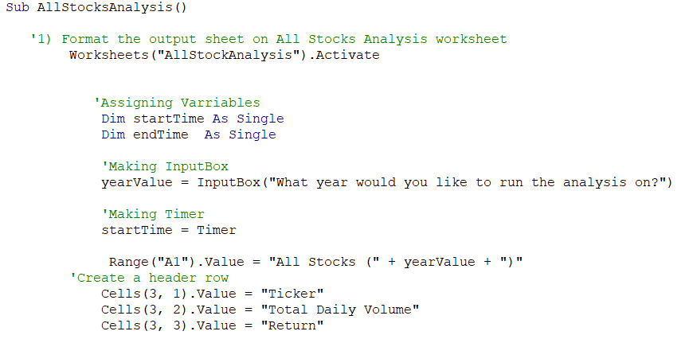
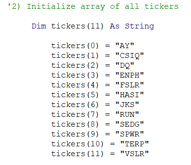
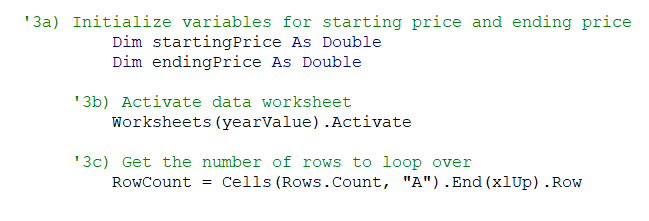
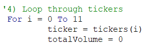
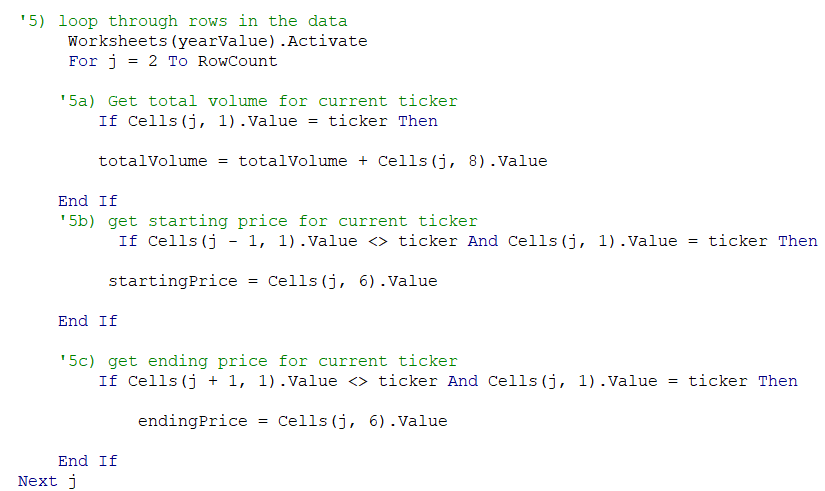
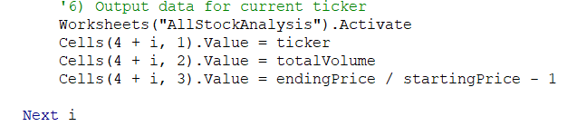
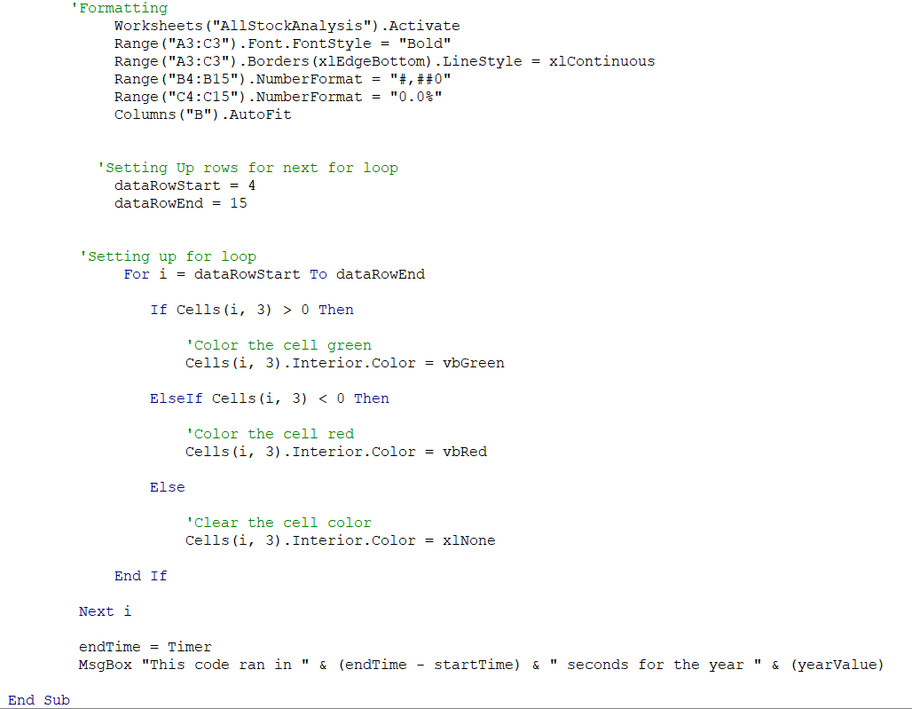
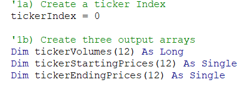
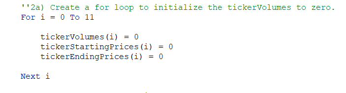
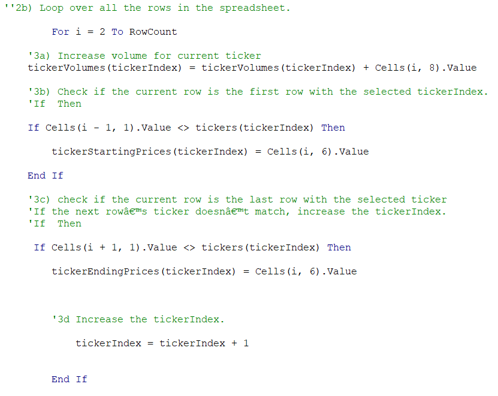

# stock-analysis

## Overview of Project
*This project focused on the use of refactored VBA code, optimization of for loops, and measurement of performance. * All data for this project came from a pre-entered accounting Excel sheet for stock analysis specifying ticker; data, open, high, low, close, adj close, and volume. 
### Purpose
The goal of this project was to use refactored code to optimize for loops and decrease run time.
##Results
The original code in question was mode to output the specific year for which the data is being analyzed; tickers, total daily volume, and return corresponding to tickers. In order to automate this system a VBA script was set up to output the former values.

### Original VBA script
The first step of setting up the VBA code was to make a subroutine called AllStocksAnalysis() and format the output on the worksheet. This was done by activating the worksheet we wanted out output to be on, assigning variables, making an InputBox, timer, and row headers.

The second step was to initialize an array of all tickers and initializing a variable for the tickers.

 

Next starting price and ending price were initialized as variables, the correct worksheet, and the number of rows our following for loop will loop over.

Now that all the components were set up the for loop was able to be initiated. The for loop starts by defining the parameters of the for loop and setting the total volume to zero.

Then a nested for loop is initiated with a set of if then statements to set the parameters for our nested for loop.

Output parameters were then added after the end of the nested for loop. These parameters specify the value of specific columns and rows.

 

After the initial for loop was ended a series of statements were used to format the worksheet. A for loop was used to automate conditional formatting which makes the analysis much easier for the user. Additionally, the timer and message bow was added after the end of all the for loops to display the time in a message box.

### Updated Code
While the original code preformed the desired task successfully, there was a more efficient was the code could have been written to decrease run time. The main issue was with the nested for loop and the assignment of variables. While beneficial, nested for loops can slowdown runtime and same with not assigning variables. 
In order to optimize the code, we start by creating a ticker index and creating three arrays for ticker volume, ticker starting price, and ticker ending price. The ticker index is set equal to zero to tell the script to start at our first ticker.

A for loop across all the tickers was then initiated and ticker volumes, starting prices, and ending prices were initialized by setting them equal to zero.

Then another for loop was initialized after the last for loop ended. This for loop goes through all rows on specific year worksheets to pull data. A series of if then statements were then created to produce desired ticker volumes, starting prices, and ending prices. Additionally, the ticker index was set to ticker index plus one at the end of the for loop to tell the program to run the next index value after the pervious index value is done. 

Using more assigned variables and sets of for loops the program is able to more effectively run through the data and cut down on run time. For instance, the original run time was about .9 seconds for 2017 data and about .8 seconds for 2018. However, the new code provided runtimes of .2 and .16 seconds for 2017 and 2018 respectively. 

## Summary
By optimizing how variables are assigned and not using nested for loops the code was able to run in about a fourth of the time. This is also due to setting up clear steps so that the code can be run in a systematic manner without repeating any steps.

### Advantages and Disadvantages of Refactoring Code
Using refactored code is a great tool which provides a starting block. Think of refactored code as a template which you can use to mold new code instead of starting from scratch. However, while using refactored code disadvantages come in when bugs or not optimal coding is used in the original code. This is why it is always important to check the code before using it as refactored code to avoid major issues. It is also important to think through your new code and find areas which need to be optimized to make the new piece of code as efficient as possible.  

### Advantages and Disadvantages of Original and Refactored VBA Script 
The first VBA script was a nice starting block because it had clear visual organization of the flow and where all data was being pulled from. However, the original code took four times the amount of time to run compared to the new code. The refactored VBA script had better code flow and organization, while initially hard to understand the code was optimized so that the program did not have to repeat any steps. This made the refactored code run 4 times quicker than the original and made it the more optimal candidate for the VBA script. 
